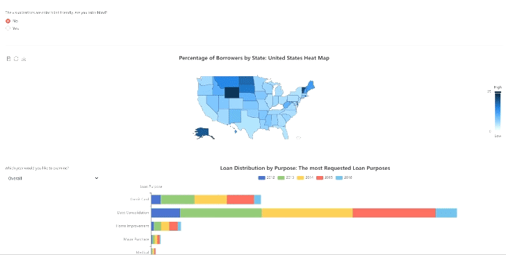

# LendingClub-Loan-Visualization
View the interactive dashboard now! (which is also color blind friendly)

## Table of Contents :clipboard:
  * [Introduction](#Introduction-bookmark_tabs)
  * [Goals](#goals-dart)
  * [Data Description](#data-description-bar_chart)

## Introduction :bookmark_tabs:
The subject of the visualization involves examining the evolution of borrower characteristics in the United States across various dimensions over the years. 
Through a variety of diverse visualizations, borrower characteristics are analyzed across different categories, including job titles, loan purposes, economic indicators and more. These visualizations enable geographical mapping of trends and allow for data filtering by year.

## Goals :dart:
The primary research question is:

What are the trends and patterns in the changing characteristics of borrowers in the US over the years?

## Data Description :bar_chart:
The visualization theme focuses on the 'Lending Club Loan' dataset sourced from Kaggle, which comprises loan data from the LendingClub company spanning from 2012 to 2016. The dataset comprises 74,971 observations and 27 features, each representing a customer loan along with its associated details.
